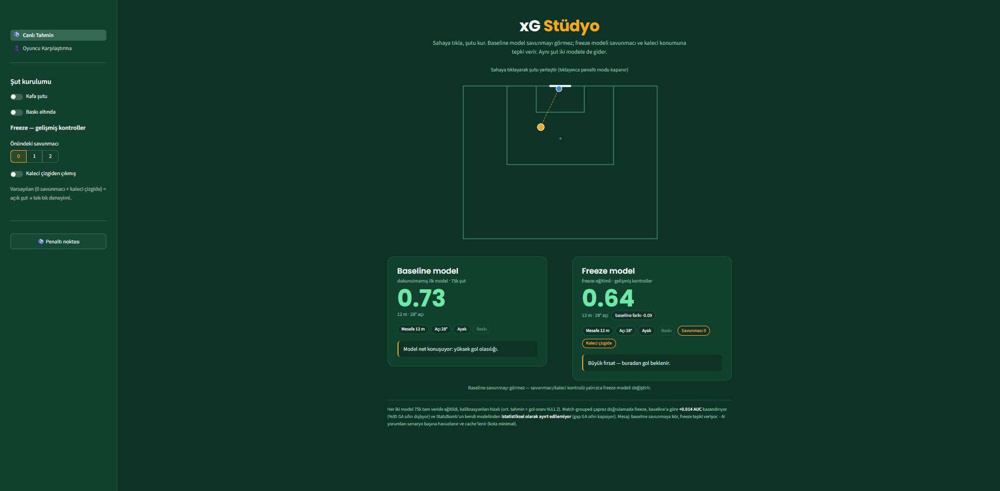
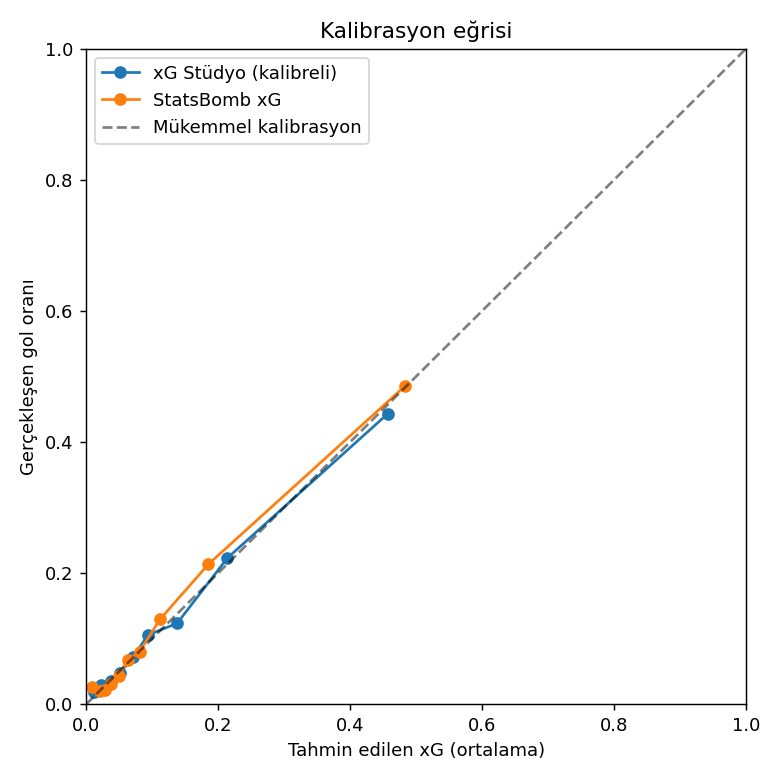

# xG Stüdyo — Canlı Şut Kalitesi (xG) Tahmin Motoru

**Workintech Data Scientist & AI — kapanış projesi**

StatsBomb açık verisiyle eğitilmiş bir **xG (Expected Goals)** modeli, canlı bir
**Streamlit** arayüzü ve **Gemini Flash** AI yorum katmanından oluşan uçtan uca bir
MLOps projesi. Sadece bir notebook değil — local'de eğitilip cloud'da serve edilen,
link'i olan herkesin deneyebileceği çalışan bir ürün.

🎮 **Canlı demo (kurulumsuz):** https://ubtuna.github.io/xG-Studio/



👥 **Ekip:** Uğur Batuhan Tuna · Doruk Pamir · Mert Kaan Topuz

---

## İçindekiler
- [xG nedir](#xg-nedir)
- [Ne yapıyor](#ne-yapıyor)
- [Mimari](#mimari)
- [Veri katmanı](#veri-katmanı)
- [Model katmanı](#model-katmanı)
- [Sağlamlık (robustness)](#sağlamlık-robustness)
- [Bonus: Oyuncu Karşılaştırma modeli](#bonus-oyuncu-karşılaştırma-modeli)
- [Ürün katmanı](#ürün-katmanı)
- [Klasör yapısı](#klasör-yapısı)
- [Kurulum ve çalıştırma](#kurulum-ve-çalıştırma)
- [Tekrar üretim](#tekrar-üretim)
- [Lisans ve atıf](#lisans-ve-atıf)

---

## xG nedir

xG (Expected Goals), bir şutun gol olma olasılığıdır: `0 = imkânsız`, `1 = kesin gol`.
Örneğin xG 0.20 olan bir şut, 100 kez tekrarlansa ~20'si gole döner. Skor bazen
şansı yansıtır; xG ise "kim daha çok gol hak etti"yi ölçer. Bu proje, her şutu
mesafe/açı/baskı gibi geometrik ve bağlamsal özelliklerden yola çıkarak bir
**classification** problemi olarak modelliyor (hedef: gol mü, değil mi).

---

## Ne yapıyor

Kullanıcı saha üzerinde bir şut konumlandırır; model gol olma olasılığını (xG)
anında hesaplar. **İki model yan yana** çalışır ve farkları canlı görülür:

- **baseline** — mesafe, açı, vücut bölgesi, baskı, oyun durumu. Savunmayı *görmez*.
- **freeze** — baseline'ın üstüne **şut anı oyuncu konumları** (freeze frame):
  `opp_in_cone` (şut konisindeki rakip), `gk_dist_ball`, `gk_dist_goal`. Savunmacı
  ve kaleci konumuna *tepki verir*.

Bir **AI yorum katmanı** (Gemini Flash) sonucu tek cümleyle insan diline çevirir;
yorumlar senaryo başına havuzlanıp cache'lenir (LLM kotası minimal).

---

## Mimari

Maliyet-bilinçli **local → cloud** akışı:

```
LOCAL (eğitim)                         GOOGLE CLOUD (serving)
─────────────────                      ──────────────────────
statsbombpy → feature engineering →    GCP VM  →  Streamlit (canlı arayüz)
              model + kalibrasyon                 + AI yorum katmanı
              (joblib)                            (Gemini Flash, cache'li)
```

- **Eğitim** local'de yapılır (makineyi yormadan), `joblib` ile kaydedilir.
- **Serving** GCP VM üzerinde Streamlit ile yapılır.
- **Fallback zinciri:** GCP VM → GitHub Pages (`docs/index.html`, kurulumsuz) → localhost.

---

## Veri katmanı

- **Kaynak:** StatsBomb Open Data (`statsbombpy`), açık ve ücretsiz, CC BY-SA 4.0.
- **Kapsam:** 54 lig-sezon, 2.989 maç. La Liga belkemiği; ayrıca Champions League,
  Ligue 1, Premier League, Bundesliga, Serie A, Dünya Kupası, Euro, FA WSL ve
  Kadınlar Dünya Kupası seçili sezonları.
- **`data/shots_features.parquet`** — 75.349 şut, sıfır eksik veri, gol oranı %11.2.
  Baseline tablo: mesafe/açı ham (x, y) koordinatından türetildi; bool'lar `NaN→False`,
  kategorikler metin olarak bırakıldı (encoding model aşamasında).
- **`data/shots_freeze.parquet`** — aynı 75.349 şut + freeze feature'ları
  (`opp_in_cone`, `gk_dist_goal`, `gk_dist_ball`). Freeze eksik oranı yalnızca ~%1.2
  (NaN; XGBoost doğal olarak işler).

> `statsbomb_xG` kolonu **referans** olarak tutulur; asla feature olarak kullanılmaz.
> Kendi modelimizi onunla karşılaştırıp doğrularız.

---

## Model katmanı

**Pipeline (her iki model):**

```
OneHotEncoder(handle_unknown='ignore')
  → XGBoost (n_estimators=400, max_depth=4, learning_rate=0.05)
  → isotonic kalibrasyon (CalibratedClassifierCV, cv=5)
```

`random_state=42`. Model `joblib.load(...)['model']` ile yüklenir; dict ayrıca
feature listeleri, dağılım-dışı (OOD) guard ve metrikleri içerir.

- **`models/xg_model.joblib` (baseline):** mesafe, açı, `under_pressure`,
  `shot_first_time`, `shot_one_on_one`, `body_part`, `technique`, `shot_type`,
  `play_pattern`. `position` (zayıf) ve ham `x/y` (mükerrer) **kasten atıldı**.
- **`models/xg_model_freeze.joblib` (freeze):** üstüne `opp_in_cone`,
  `gk_dist_goal`, `gk_dist_ball`.

### Sonuçlar (aynı test seti, tek-split)

| Model | ROC-AUC | Brier |
|---|---|---|
| baseline | 0.802 | 0.0805 |
| **freeze** | **0.818** | 0.0777 |
| StatsBomb referans | 0.819 | — |

Kalibrasyon hizalı: ortalama tahmin ≈ gerçek gol oranı (~0.112), yani "%14" gerçekten
~%14 anlamına gelir.



*Kalibrasyon eğrisi: tahmin edilen xG (x) ile gerçekleşen gol oranı (y). Modelimiz (mavi) köşegene — mükemmel kalibrasyona — neredeyse yapışık, yani "%14 gerçekten ~%14" demektir. StatsBomb'un kendi xG'si (turuncu) ile aynı hizada; bazı aralıklarda köşegene daha da yakın.*

**Ana çıkarım:** Tavanı algoritma değil **bilgi** belirliyordu. XGBoost ↔ LightGBM ve
tuning fark yaratmadı; StatsBomb'un üstünlüğü kullandığı şut-anı oyuncu konumlarından
(freeze frame) geliyordu. Bu bilgiyi modele besleyince eksik parça kapandı.

---

## Sağlamlık (robustness)

Manşet rakamların gürültü olmadığı istatistiksel olarak doğrulandı
(`reports/robustness_check.md`, `src/xg_robustness.py`).

- **Yöntem:** match-grouped 5-fold OOF (her tahmin, o maçı hiç görmemiş modelden)
  + maç seviyesinde **cluster bootstrap** (n=2000). Şutlar maç içinde korele
  olduğundan satır değil maç resample edilir.
- **Split leakage testi:** row-stratified vs match-grouped split — şişme yok.

| Metrik | Nokta | %95 GA | Karar |
|---|---|---|---|
| **lift** (freeze − baseline) | **+0.0140** | [+0.0121, +0.0161] | **GERÇEK** — GA sıfırı dışlıyor |
| **gap** (StatsBomb − freeze) | +0.0013 | [−0.0012, +0.0037] | **AYIRT EDİLEMEZ** — GA sıfırı kapsıyor |
| Brier iyileşme (paired) | +0.0025 | [+0.0021, +0.0028] | GERÇEK |

> **Manşet:** Freeze frame geometrisini ekleyince modelimiz StatsBomb'un kendi
> xG'sinden **istatistiksel olarak ayırt edilemez** hale geldi; freeze lift'i ise
> **+0.014 AUC** ile anlamlı.

---

## Bonus: Oyuncu Karşılaştırma modeli

`models/xg_model_player_xgboost.joblib` — ana modelden farklı olarak `player`
(oyuncu kimliği) ve `position`'ı **feature olarak** kullanır. Test AUC'si freeze ile
aynı (~0.819) ama `player_*` importance payı ~%50 olmasına rağmen AUC'ye katkısı ~0 →
**overfitting imzası**. Aynı şutta az şutu olan oyunculara (örn. Bale, 124 şut) aşırı
uç tahmin verir; sıralama bitiricilik değil, örneklem gürültüsüdür.

Bu model **bilinçli olarak ayrı bir "bonus" sayfada** durur ve ana modele entegre
**edilmez**. Ana modelde `player`'ı neden kasten attığımızın canlı kanıtıdır.

---

## Ürün katmanı

- **`app/app.py`** — `st.navigation` giriş dosyası. İki sayfa: "⚽ Canlı Tahmin"
  (ana demo) ve "👤 Oyuncu Karşılaştırma" (bonus).
- **`app/streamlit_app.py`** — ana demo: sahaya tıkla → baseline vs freeze xG yan yana
  + delta + AI yorumu. Kontroller: Kafa, Baskı, Savunmacı (0/1/2), Kaleci, ⚽ Penaltı.
- **`app/player_comparison.py`** — bonus oyuncu karşılaştırma sayfası (xG'ye göre
  sıralı yatay bar, az-veri uyarısı, overfit notu).
- **`docs/index.html`** — kurulumsuz standalone interaktif demo (GitHub Pages).
- **AI yorum katmanı:** `GOOGLE_API_KEY` tanımlıysa Gemini Flash; yoksa yerel varyant
  havuzuna düşer (internetsiz de çalışır). Senaryo başına cache → kota minimal.

---

## Klasör yapısı

```
app/      app.py (giriş/nav) · streamlit_app.py (ana demo)
          player_comparison.py (bonus) · requirements.txt
          .streamlit/config.toml (deck temalı renkler)
src/      fetch_shots.py · build_features.py · build_freeze_features.py
          train_model.py · train_freeze_merged.py · xg_robustness.py
models/   xg_model.joblib · xg_model_freeze.joblib · xg_model_player_xgboost.joblib
data/     shots_features.parquet · shots_freeze.parquet
docs/     index.html (GitHub Pages standalone demo)
reports/  robustness_check.md
config/   leagues.py (54 lig-sezon id)
```

---

## Kurulum ve çalıştırma

Modeller ve veri repoda hazır gelir — yeniden eğitim gerekmez.

```bash
git clone https://github.com/ubtuna/xG-Studio.git
cd xG-Studio
pip install -r app/requirements.txt

# (opsiyonel) AI yorumları için Gemini anahtarı; yoksa yerel havuz kullanılır
export GOOGLE_API_KEY=...

# çok-sayfa uygulamayı başlat
streamlit run app/app.py
```

Tarayıcıda `http://localhost:8501` açılır. Sol menüden iki sayfa arasında geçiş yapılır.

> **Not:** `streamlit-image-coordinates` kuruluysa sahaya tıklayarak şut yerleştirilir;
> kurulu değilse otomatik olarak kaydırıcılara düşer.

---

## Tekrar üretim

```bash
# freeze feature çıkarımı (statsbombpy'dan, sezon başına cache)
python src/build_freeze_features.py

# model eğitimi
python src/train_freeze_merged.py

# sağlamlık kontrolü (cluster bootstrap + split leakage testi)
python src/xg_robustness.py --data data/shots_freeze.parquet --n-boot 2000 --folds 5
```

Notlar:
- Train/val/test ayrımı maç ID'ye göre gruplanır (aynı maçın şutları farklı setlere
  dağılmasın → leakage yok). `statsbomb_xG` benchmark olarak tamamen ayrı tutulur.
- SMOTE/sınıf yeniden ağırlıklandırma **yok** — kalibrasyon bütünlüğü için base rate
  korunur (~%11 pozitif yeterli).

---

## Lisans ve atıf

Veri: **StatsBomb Open Data**, CC BY-SA 4.0 — atıf zorunludur.
Bu proje eğitim amaçlı bir kapanış projesidir.
